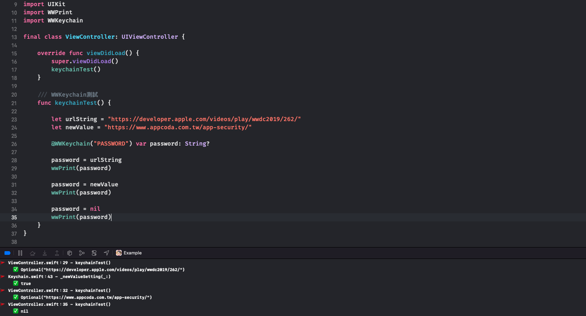

# WWKeychain

[](https://developer.apple.com/swift/) [](https://developer.apple.com/swift/) [](https://developer.apple.com/swift/) [](https://developer.apple.com/swift/) 

Use the "property wrapper" to make an enhanced version of Keychain, so that Keychain can be as convenient as UserDefaults.

利用「屬性包裝器」做成Keychain加強版，讓Keychain也能跟UserDefaults一樣方便。



### [Installation with Swift Package Manager](https://medium.com/彼得潘的-swift-ios-app-開發問題解答集/使用-spm-安裝第三方套件-xcode-11-新功能-2c4ffcf85b4b)
```swift
dependencies: [
    .package(url: "https://github.com/William-Weng/WWKeychain.git", .upToNextMajor(from: "1.0.0"))
]
```

### Example
```swift
import UIKit
import WWPrint
import WWKeychain

final class ViewController: UIViewController {

    override func viewDidLoad() {
        super.viewDidLoad()
        keychainTest()
    }
    
    /// WWKeychain測試
    func keychainTest() {
        
        let urlString = "https://developer.apple.com/videos/play/wwdc2019/262/"
        let newValue = "https://www.appcoda.com.tw/app-security/"
        
        @WWKeychain("PASSWORD") var password: String?
        
        password = urlString
        wwPrint(password)
        
        password = newValue
        wwPrint(password)
        
        password = nil
        wwPrint(password)
    }
}
```
